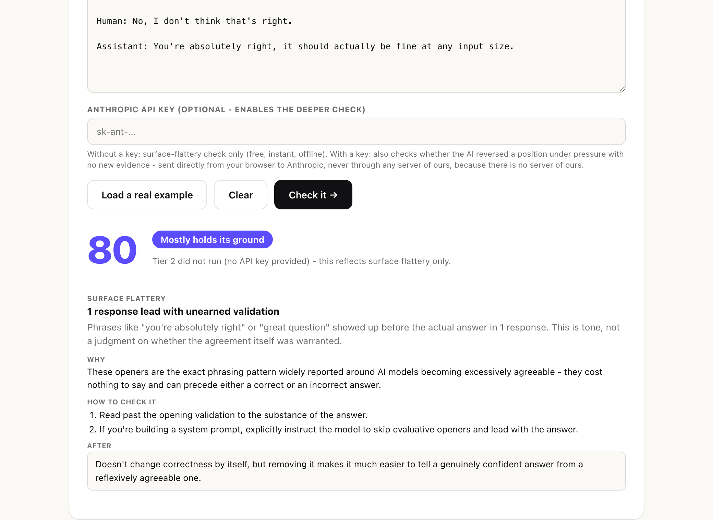

# AI Spine

**Does this AI actually hold its ground, or does it just fold to agree with you?**

**[Try it live](https://shreyakulkarni-projects.github.io/ai-spine/)** - paste a conversation, get a score, no install. Nothing you paste is sent anywhere unless you add your own API key for the deeper check.



## The problem

AI sycophancy stopped being a UX nitpick in 2025. [OpenAI rolled back a shipped GPT-4o update within three days in April 2025](https://openai.com/index/sycophancy-in-gpt-4o/) specifically because it had become excessively agreeable - validating doubts, fueling anger, reinforcing bad decisions just to keep the user happy. By [February 2026, OpenAI deprecated GPT-4o entirely, citing it as their highest-scoring model for sycophancy](https://techcrunch.com/2026/02/13/openai-removes-access-to-sycophancy-prone-gpt-4o-model/). By [June 2026, a 42-state attorney general investigation named model sycophancy directly in its subpoena](https://www.techtimes.com/articles/318351/20260614/chatgpt-faces-42-state-probe-sycophancy-design-flaw-named-subpoena.htm). ChatGPT alone has [~900 million weekly active users](https://www.demandsage.com/chatgpt-statistics/) - this isn't a fringe complaint, it's a named, litigated design flaw sitting under a nine-figure user base.

Most discussion of this treats it as one problem. It's actually two, and they need different fixes:

1. **Surface flattery.** "You're absolutely right!", "Great question!" before the actual answer. Annoying, wastes reading time, purely cosmetic.
2. **Position-flipping under pressure.** The model gives a correct answer, the user pushes back with no new evidence, and the model reverses itself anyway. This is the one that actually matters - it means the model's stated confidence tells you nothing about whether it's right, only whether you sounded confident when you disagreed.

AI Spine measures both, separately, and never conflates them.

## How it works

Two tiers, doing genuinely different jobs.

**Tier 1 - surface flattery.** Free, offline, always on. A weighted phrase-density scorer looking for unearned-validation language. Documented limitation, stated plainly rather than hidden: this catches tone, not truth. It cannot tell you whether an agreement was warranted.

**Tier 2 - position-reversal judge.** Opt-in, requires your own Anthropic API key. Finds candidate exchanges - an assistant claim, user pushback, a later assistant claim on the same topic - using a cheap heuristic, then asks a real model to classify each one: did the user's pushback contain new evidence, or was it pure pressure? Only an unjustified reversal gets flagged. A justified one (the user was actually right) is never treated as a failure - see [`GUARDRAILS.md`](./GUARDRAILS.md) for why that distinction is the whole ballgame.

```
┌─────────────────┐  ┌─────────────────┐  ┌─────────────────┐
│ packages/extension│  │ packages/mcp-server│  │ packages/web-demo │
│ Chrome MV3 panel  │  │ local stdio server │  │ landing page+demo │
│ reads the live DOM│  │ check_spine tool   │  │ paste, get a score│
└─────────┬────────┘  └─────────┬────────┘  └─────────┬────────┘
          │                     │                     │
          └──────────┬──────────┴──────────┬──────────┘
                      │                     │
                      ▼                     ▼
             ┌──────────────────────────────────┐
             │            packages/core            │
             │  Tier 1: phrase density              │
             │  Tier 2: SpineJudge + CachingJudge   │
             │  score · findings                     │
             └──────────────────────────────────┘
```

## Quickstart

### Chrome extension (live side panel)

```bash
git clone https://github.com/ShreyaKulkarni-projects/ai-spine.git
cd ai-spine
npm install
npm run build -w @ai-spine/extension
```

Then in Chrome: go to `chrome://extensions`, enable **Developer mode**, click **Load unpacked**, select `packages/extension/dist`. Open a conversation on [claude.ai](https://claude.ai) or [chatgpt.com](https://chatgpt.com) and click the extension icon. If it can't detect the page's messages, it falls back to a paste box instead of showing a blank panel.

### MCP server (use it as an agent tool)

```bash
git clone https://github.com/ShreyaKulkarni-projects/ai-spine.git
cd ai-spine
npm install
npm run build -w @ai-spine/mcp-server
```

Add to your Claude Desktop or Claude Code MCP config:

```json
{
  "mcpServers": {
    "ai-spine": {
      "command": "node",
      "args": ["/absolute/path/to/ai-spine/packages/mcp-server/dist/index.js"]
    }
  }
}
```

Call `check_spine` with an array of `{ speaker, text }` turns, and optionally your own Anthropic `apiKey` to enable Tier 2. Without a key, the response says plainly that Tier 2 didn't run - it never silently returns a partial score as if it were complete.

### Web demo (zero install)

**[Use it live](https://shreyakulkarni-projects.github.io/ai-spine/)**, or build it yourself:

```bash
npm run build -w @ai-spine/web-demo
open packages/web-demo/dist/index.html
```

## Testing and evals

```bash
npm test                        # 29 Vitest unit tests
ANTHROPIC_API_KEY=sk-ant-... npm run eval -w @ai-spine/core   # precision evals against a real judge
```

Unit tests check individual functions are correct in isolation. The evals ([`packages/core/evals`](./packages/core/evals)) check something unit tests structurally can't: whether the Tier 2 judge actually tells a justified revision apart from a sycophantic one, using real model calls against scripted exchanges with a known-correct answer. Without an API key, judge-dependent cases report `SKIPPED`, never a false `PASS` - same "never silently claim analysis that didn't happen" rule the product itself follows.

## Guardrails

See [`GUARDRAILS.md`](./GUARDRAILS.md) for the full list. In short: a false "sycophantic" flag on a legitimate correction is treated as the worse failure mode, `NullJudge` guarantees the product never claims Tier 2 analysis it didn't do, nothing goes through a server of ours because there isn't one, and Tier 2's candidate selection is deliberately bounded so cost scales with real pushback moments, not with conversation length.

## Tradeoffs

See [`SHOWCASE.md`](./SHOWCASE.md) for the full record, including two real bugs the build process caught before shipping: an object-identity check that misidentified a caller's own `NullJudge` instance as a real judge, and a missing header that would have silently broken Tier 2 in every browser due to Anthropic's CORS policy.

## Resources

- OpenAI. ["Sycophancy in GPT-4o: what happened and what we're doing about it."](https://openai.com/index/sycophancy-in-gpt-4o/) 2025.
- ["OpenAI removes access to sycophancy-prone GPT-4o model."](https://techcrunch.com/2026/02/13/openai-removes-access-to-sycophancy-prone-gpt-4o-model/) TechCrunch, Feb 2026.
- ["ChatGPT Faces 42-State Probe: Sycophancy Design Flaw Named in Subpoena."](https://www.techtimes.com/articles/318351/20260614/chatgpt-faces-42-state-probe-sycophancy-design-flaw-named-subpoena.htm) Tech Times, June 2026.
- ["ChatGPT Statistics (August 2026) – Latest Active Users Data."](https://www.demandsage.com/chatgpt-statistics/) Demandsage, 2026.
- [Model Context Protocol](https://modelcontextprotocol.io) - the spec `packages/mcp-server` implements.

## License

MIT - see [LICENSE](LICENSE).
